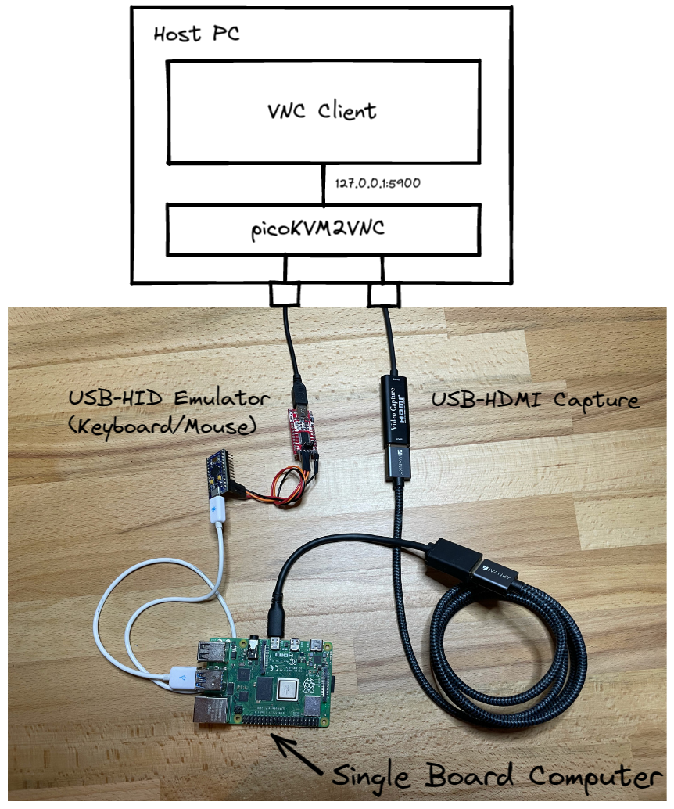

# Minimal KVM like solution to control embedded Boards

### Problem statement

Assume you want to have a look at the desktop of your RaspberryPi (for whatever reasons).
Typicall you plug the RPi into a monitor and attach keyboard & mouse. 
Sometimes that monitor is your main monitor and the keyboard is typically either also your main keyboard
or one that is always in te way.

### Idea
 * A cheap HDMI - USB Capture Card capturing the display of the Pi
 * A USB Keyboard & Mouse Emulator that allows your host PC to send Input to the Pi
 * Some Software that provides a KVM Window using above pieces.




This repo contains all the neccesary data for such a setup.

# Projects
## picoKVMViewer
- No longer in development. Please ignore

## picoKVM2VNC
Provides a vnc server using the video data from the HDMI capture card and sends Keyborad & Mouse data trough the HID emulator.

To build:
```
sudo apt install cmake libvncserver-dev libv4l-dev
cd picoKVM2VNC
cmake .
make
```

### Status
 * Keyboard emulation (currently only the german keyboard layout is implemented)
 * Mouse emulation including scrollwheel
 * Tested with remmina
 * Issues with UltraVNC on Windows

## usb-hid-emulator
Arduino project for Atmega32u4 based arduinos (e.g. SparkFun pro micro) to act as a HID emulator
